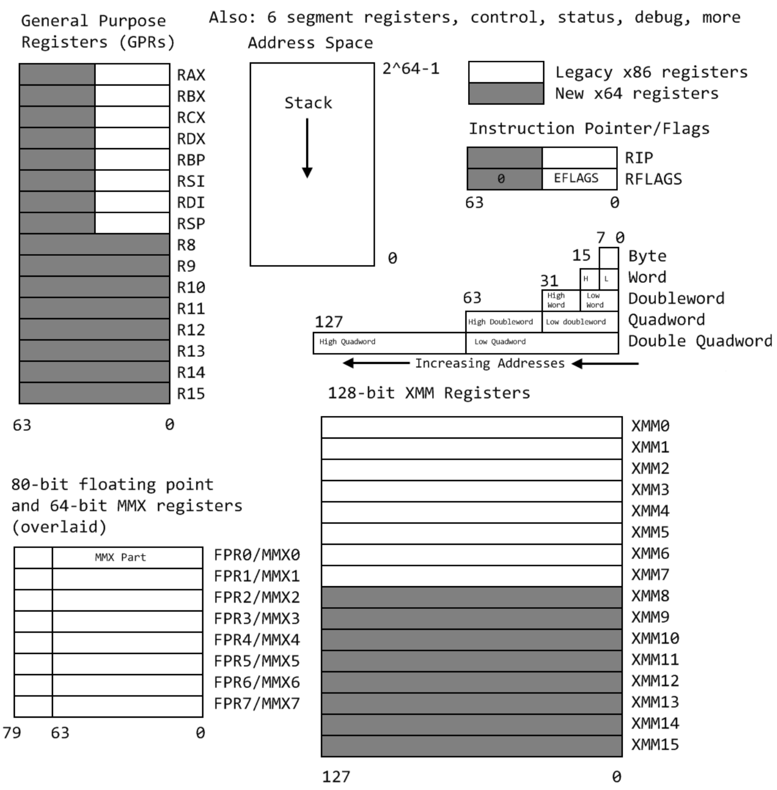

## 汇编语言 基于x86处理器(原书第7版) 随书代码
[书籍官方网站](http://www.asmirvine.com/index6th.htm)  
[intel x86 官方指导](https://software.intel.com/content/www/us/en/develop/articles/introduction-to-x64-assembly.html)  
[x86 汇编概览](https://www.cs.virginia.edu/~evans/cs216/guides/x86.html)  
[x86与amd64指令 x86 and amd64 instruction reference](https://www.felixcloutier.com/x86/)  

 

x86通用架构 
</img>  

 

 

指令概览 
</img>  

 

### vs工程及Debug
[官方提供的工程](http://www.asmirvine.com/gettingStartedVS2015/index.htm)  
- [Project32_VS2015.zip](Project32_VS2015.zip)  
- [Project64_VS2015.zip](Project64_VS2015.zip)  

> vs安装时需要选择`visual c++`相关功能  

####  vs工程
首先需要把依赖库放在C:\Irvine位置,如果更换，需要更改工程中依赖库路径.  
 

</img>  

 

在官方下载vs2015工程,通过vs打开该工程文件。  
 

配置vs的Start without Debugging。在调试菜单中增加一个新命令，不进行调试就开始。
  
 

</img>  

 

导入汇编文件,比如:/ch03/AddTwo_64.asm  
右击选择添加已有文件，选择asm文件，构建项目，成功即可。  

 

</img>  

 

如果需要查看寄存器值、内存视图、调用堆栈可以打开对应窗口:  

 

</img>  

 

 

</img>  

 

- [第四章 数据传送、寻址和算数运算](./ch04/README.md)
- [第四章 过程](./ch05/README.md)