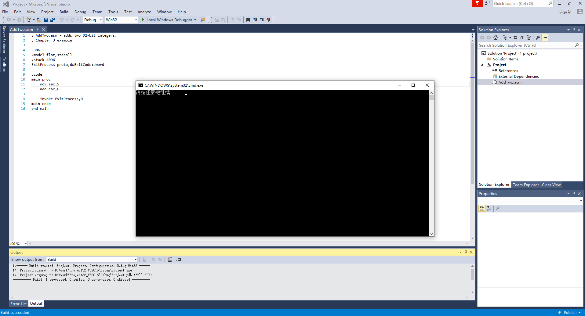

## 汇编语言 基于x86处理器(原书第7版) 随书代码
[官方网站](http://www.asmirvine.com/index6th.htm)

### vs工程及Debug
####  vs工程
首先需要把依赖库放在C:\Irvine位置,如果更换，需要更改工程中依赖库路径.  
 

</img>  

 

在官方下载vs2015工程,通过vs打开该工程文件。  
 

配置vs的Start without Debugging。在调试菜单中增加一个新命令，不进行调试就开始。
  
 

</img>  

 

导入汇编文件,比如:/ch03/AddTwo_64.asm  
右击选择添加已有文件，选择asm文件，构建项目，成功即可。  

 

</img>  

 

如果需要查看寄存器值、内存视图、调用堆栈可以打开对应窗口:  
 

</img>  

 

