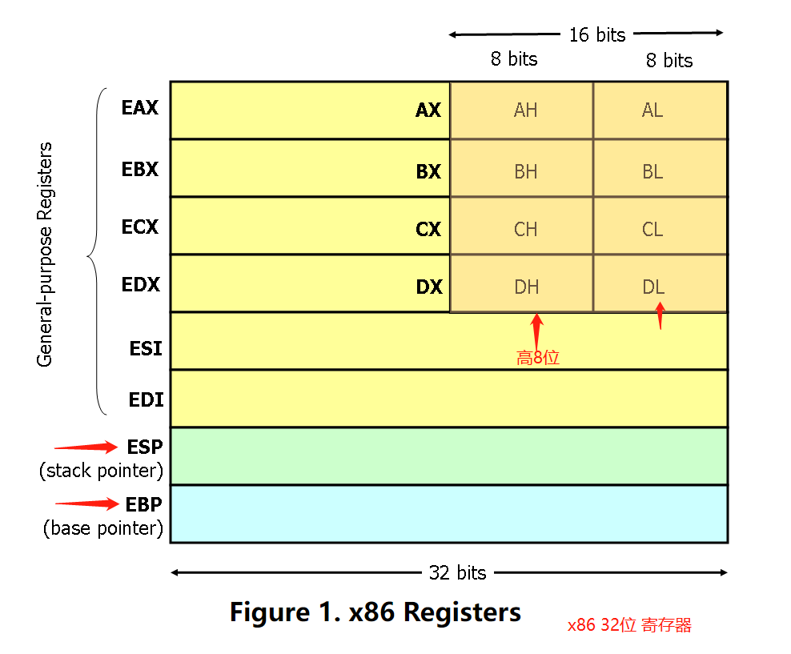
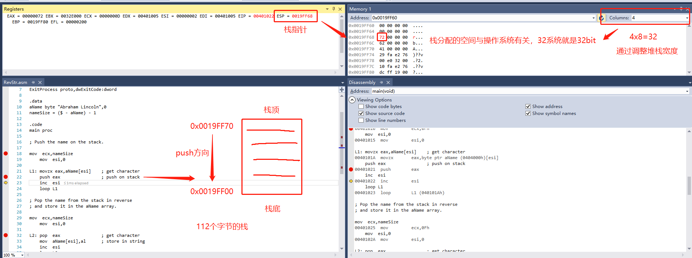
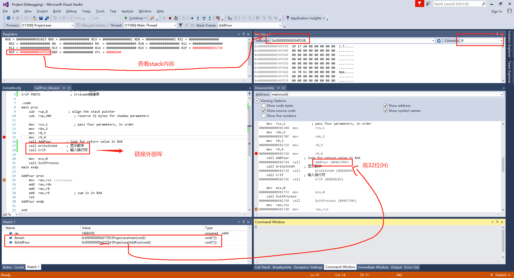
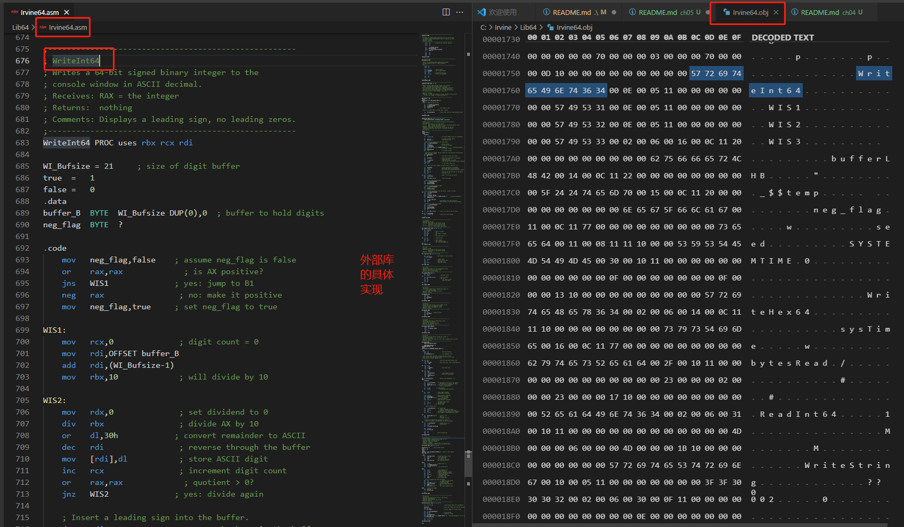
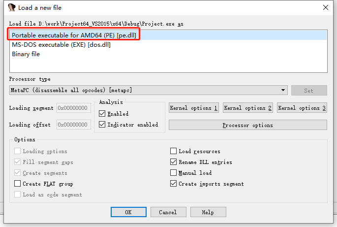
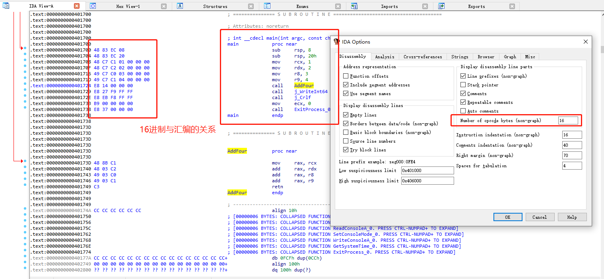
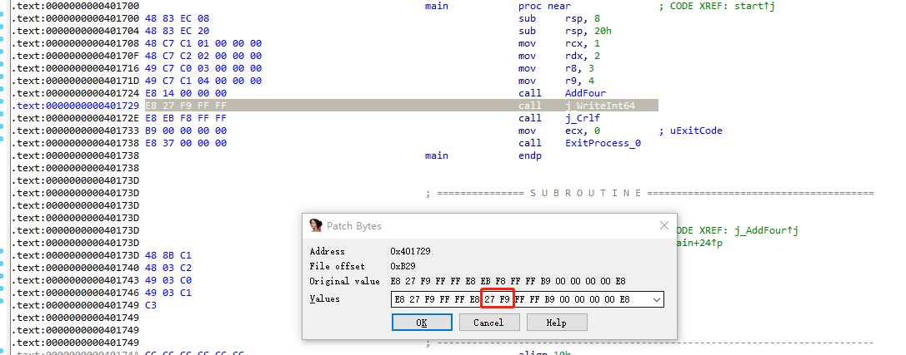

## 第五章 过程
与外部链接库的链接、描述本书链接库、堆栈操作、过程的定义和使用、流程图、自顶向下的结构设计  

<br>
<div align=center>
</img>  
</div>
<br>

### 5.1.2 PUSH和POP指令  
<br>
<div align=center>
<span> 调用外部库 </span> <br>
</img>  
</div>
<br>

### 5.5.4 调用过程示例  

<br>
<div align=center>
<span> 调用外部库 </span> <br>
</img>  
</div>
<br>

<br>
<div align=center>
<span> 外部库的实现 </span> <br>
</img>  
</div>
<br>

#### 拓展: 让编译后的程序多调用一次换行函数?

CallProc_64 工程目录
```
-rw-r--r-- 1 Max 197121   1411 10月  2 11:47 CallProc_64.obj
-rwxr-xr-x 1 Max 197121  12288 10月  2 11:47 Project.exe*
-rw-r--r-- 1 Max 197121  62764 10月  2 11:47 Project.ilk
-rw-r--r-- 1 Max 197121 143360 10月  2 11:47 Project.pdb
drwxr-xr-x 1 Max 197121      0 10月  2 11:47 Project.tlog/
-rw-r--r-- 1 Max 197121    136 10月  2 11:47 Project64_VS2015.log
drwxr-xr-x 1 Max 197121      0  1月 19  2017 Project64_VS2015.tlog/
```

<br>
目前程序是64位，需要使用64位的IDA程序。启动程序后，选择Project.exe文件，选择打开方式位PE  

<br>
<div align=center>
<span></span> <br>
</img>  
</div>
<br>

需要查看汇编与文件编码的对应关系，需要打开汇编的16进制显示。(IDA View右击->Text View)。  
这里不仅能看到WriteInt64的具体实现，也能看到Irvine64链接库的其他内容及函数实现。
<br>
<div align=center>
<span></span> <br>
</img>  
</div>
<br>

现在想输出两边结果，需要增加一行WriteInt64。接下来需要需改main函数的汇编。  
可以通过左边的函数窗口迅速定位到main函数的汇编实现，打开修改字节的配置:Edit->Patch program->Change byte.  然后保存修改:Edit->Patch program->Apply pathes to file. 并选择备份文件。
<br>
<div align=center>
<span></span> <br>
</img>  
</div>
<br>


  
